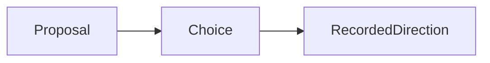

# Rich question packets and recorded decisions

A packet combines agent-authored Markdown context, question directives, human
selections and extra text in one response. It uses the same independent immutable
question/response files as plain questions. Ordinary Markdown questions and
responses without typed answers remain valid.

## Source example

The agent writes a normal item file with an explicit attention request, then
prepares a packet in its body. The full source revision and path are captured by
registration. Options start unselected; agent-authored descriptions do not count as
human choices.

````markdown
---
id: review.direction
kind: investigation
attention:
  - id: experience
    kind: decision
    state: open
    response_from: [maintainer]
    reason: Choose the response reading experience and next action.
    unblocks: [review.direction]
---
# Response reading experience

Keep the proposal, reasoning and the affected work together.



::::question{id="display" select="one"}
### Which reading experience should we build?

:::option{id="latest"}
**Latest response** — compact, with history behind a link.
:::

:::option{id="history"}
**Full history** — keep the reasoning and superseding direction visible.
:::
::::

::::question{id="checks" select="many"}
### Which checks matter?

:::option{id="back"}
Back/forward preserves the selected response.
:::

:::option{id="reload"}
Reload restores the reading context.
:::
::::

:::question{id="next" select="text"}
### What should happen next, and why?

Name the rationale, affected work and next action in your own words.
:::
````

These are remark directives, a Markdown extension rather than standard CommonMark.
Use top-level question containers and direct option containers. Single-choice
(`select="one"`, the default) and multiple-choice (`select="many"`) questions have
1–32 options; `select="text"` has no options. Each packet has at most 32 prompts.
Prompt IDs are unique within a request, option IDs within a prompt; each is a
literal identity of at most 128 characters. Unknown attributes, duplicate IDs,
invalid modes, nested controls and orphan options reject the template visibly.
Examples inside fenced code remain examples. Other Markdown components remain
available in descriptions.

If the document has several open attention requests, each question directive must
name `request="experience"` (or another declared request) explicitly. Only matching
prompts form that request's packet. Shared ordinary context is shown above them.

## Human interaction and delivery

Every prompt permits additional human text, including a text-only rejection of the
supplied framing. Clearing selections is explicit. An answer needs either a
selection or nonempty text for every prompt; clarification and deferral can explain
why the packet cannot be answered yet. The author label is local attribution,
not authenticated identity. Preview shows the complete Markdown and metadata before
one submission registers context if needed and publishes one response.

The response's optional `answers` list records `{ prompt, selected, text }` entries
in template order. `selected` contains stable option IDs and `text` contains the
human's Markdown. The server validates IDs, selection modes and completeness against
the captured context. It constructs the readable response body from the reviewed
prompt/option descriptions, human text and optional overall response. Template
links are resolved against the source so moving the record into `responses/` does
not reinterpret them. Per-prompt text is bounded to 8192 characters; the complete
recorded body remains bounded to 32768 characters and captured context to 256 KiB.

The existing CLI wait returns that one response, including typed answers, readable
body, author and reviewed context. It does not emit independent partial replies or
consume responses. Registration deadlines, repeatable reads and `--after` retain
the same semantics; the lightweight waiter does not load the directive parser or renderer.

## Changed context and superseding direction

A source edit or move does not silently carry selections into another context.
The UI preserves human text, clears choices and retains a copy of earlier answers
for recovery. Drafts retain the existing 30-day/2-MiB browser-local workspace policy.
An edit during a pending save remains a separate unsaved draft with its own identity.

An optional `supersedes` identity explicitly links a new response to an existing
response for the same item's request, including an earlier source revision. This
creates another immutable record rather than editing history. The UI qualifies
old contexts and links superseding direction; it never infers task status, closes
attention, claims criterion acceptance or launches an agent. Missing/moved source
requires reviewing and registering the available context; historical records remain
readable through their registered question identity. Ambiguous or malformed history
is unknown, not an empty answer list.
This includes syntactically damaged or unterminated frontmatter in `responses/`,
even when the parser cannot recover its record kind. Ordinary malformed Markdown
outside that record namespace does not establish a response or block feedback reads.

## Content and filesystem boundaries

Rich context, option descriptions and saved history on the response surface use the
existing Markdown/highlighting/Mermaid pipeline with raw HTML disabled. Source HTML
cannot manufacture controls or initiate writes. Mermaid remains local and strict,
with its source fallback when JavaScript is unavailable. The ordinary trusted-folder
reader keeps its existing compatibility; browser recording still requires JavaScript
and explicit server write opt-in.

The Linux-only no-replace publisher, revision/path checks and explicit rejected/
uncertain outcomes preserve the independent source records. The
[ownership boundary](./source-editing-examples.md) keeps normal project editing
with agents. Handoff and direct-editing decisions belong in the roadmap.
