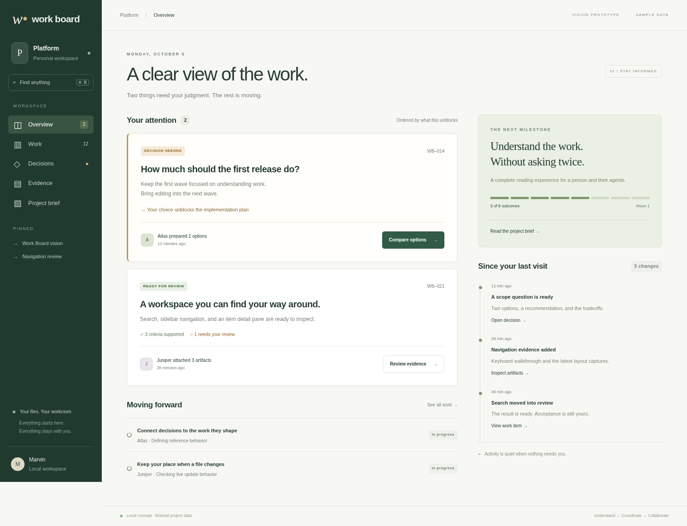
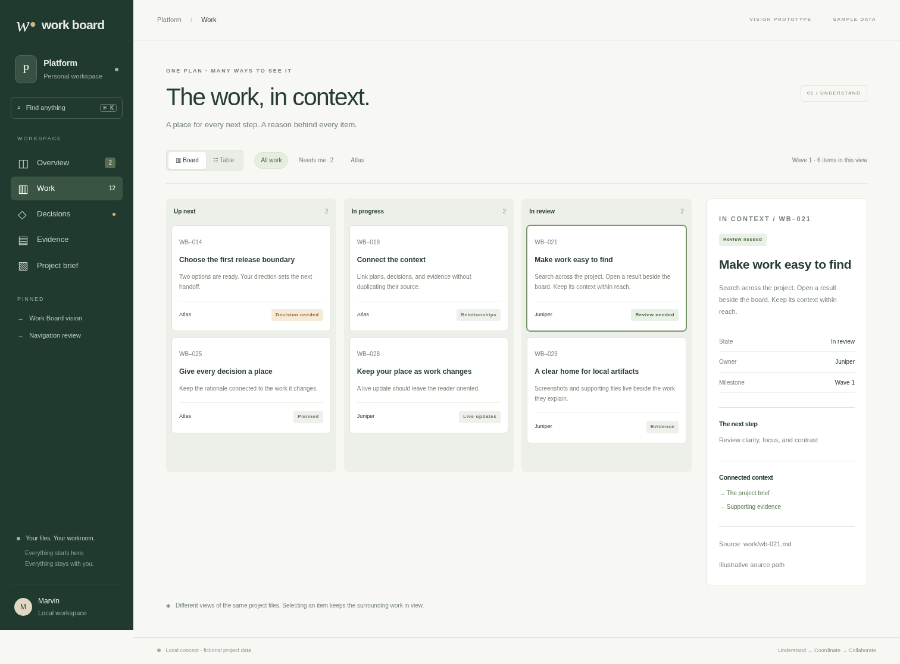
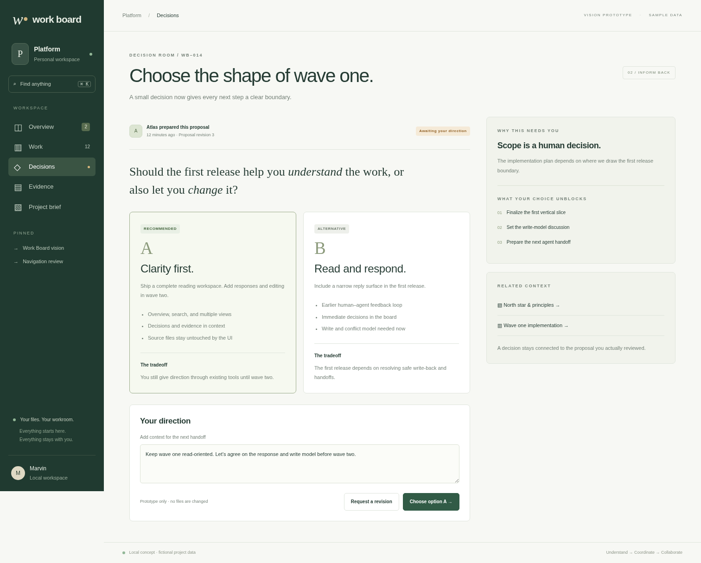
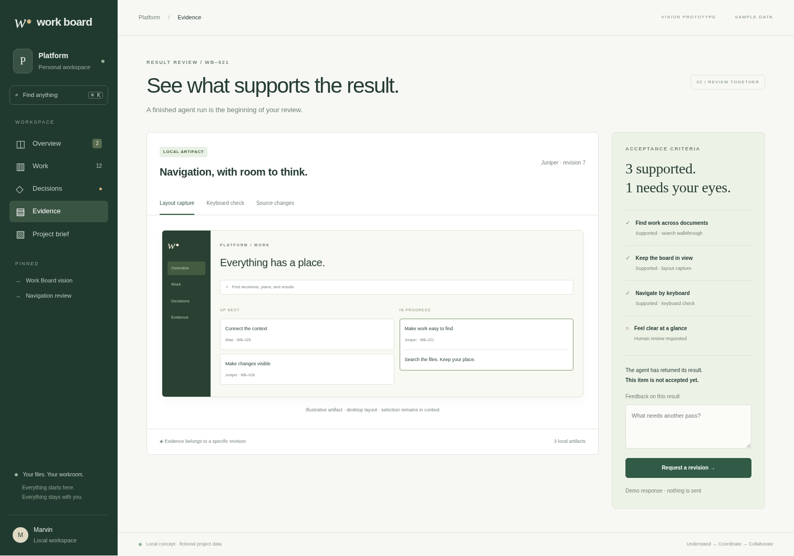
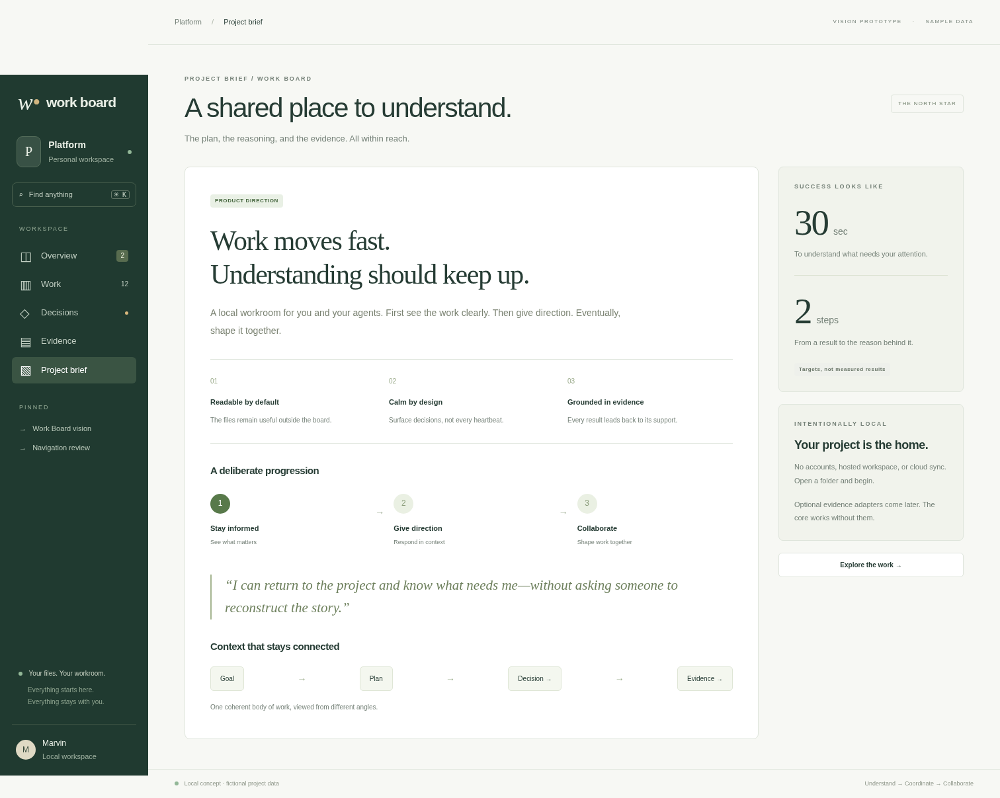

# Work Board experience design

The [north star](./north-star.md) states the intent and the [roadmap](./roadmap.md) owns status. This document describes the proposed experience, not current behavior.

## Visual direction

A calm workroom: warm paper, ink typography, dark evergreen navigation, precise rules, and restrained amber for attention. Let diagrams, evidence, and readable prose carry the page. Use system fonts so the experience works without downloads. Status always has a label; color alone does not communicate meaning.

Documents keep a readable measure. Boards and evidence comparisons use available width. Dense work has a compact setting; initial orientation has breathing room. Motion explains an update and respects reduced-motion preferences.

## Five connected scenes

| Scene | Core question | Composition |
| --- | --- | --- |
| Overview | What needs me, and what changed? | Short project brief, attention cards, active work, meaningful activity |
| Work | Where is each item, and what happens next? | Board/table over the same items, filters, persistent detail pane |
| Decision room | Which choice should we make, and why? | Question, options, recommendation, consequences, anchored response |
| Evidence | What supports this result? | Criteria beside artifacts, source revision, verified/claimed/missing distinctions |
| Project brief | How does the whole plan fit together? | Narrative, metrics, roadmap, dependency sketch, related decisions |

The prototype illustrates connected reading and coordination scenes. It is a design review artifact; use the roadmap and README to assess current behavior. All project names, counts, agent activity, timestamps, and evidence are fictional.

## Navigation and interaction

The sidebar provides project context and stable destinations. Global search finds documents, work items, and decisions; a result opens the relevant context. A work item opens beside its board rather than replacing it. A direct URL should restore selection and view when the underlying source still exists.

Overview prioritizes explicit questions, blockers, and review requests. Each attention card states why it appears and the consequence of answering it. Unranked work remains available; the queue is not an opaque AI score.

The decision room presents competing options with consequences and evidence. Recording a choice should display what will change and who receives the next handoff. A revision request stays attached to the exact proposal reviewed.

Evidence separates a tool result from an agent's claim. A green check requires supporting evidence for the relevant revision. If a criterion has no evidence, show that gap. If the proposal changed after review, retain the decision context and ask for another review where needed.

## Source and state boundaries

Project files hold authored work. An index of those files may be cached and reconstructed. Personal UI preferences and last-viewed markers may live locally outside the authored documents. Their absence must not change project meaning.

Optional metadata gives items stable identity, relationships, status, provenance, and acceptance criteria. The serialization format is a design decision, not fixed by these mockups. Ordinary Markdown remains readable. Legacy heading-based boards remain supported; missing fields are unknown rather than guessed.

Human response writes need explicit reviewed identity/context, draft retention and clear save outcomes. Agents edit ordinary files and own the surrounding project Markdown. Follow the [ownership boundary](delivery/source-editing-examples.md); do not turn rare outside-editor races into a universal transaction requirement.

## Essential states beyond the happy path

| State | Intended experience |
| --- | --- |
| Empty workspace | Explain the folder model; offer a small local template |
| Watching interrupted | Keep readable content, show freshness loss, catch up on reconnect |
| File deleted/renamed | Preserve context and offer a resolvable location; do not silently redirect to unrelated work |
| Invalid metadata/reference | Render readable prose and an actionable source diagnostic |
| Stale external evidence | Show source revision and last check; never imply current verification |
| Concurrent edit | Keep the user's draft and show the changed source before retrying |
| Pending handoff | Distinguish requested, acknowledged, running, and returned |
| Failed response/write | Retain input and explain whether anything was saved |
| Paused live updates | Display paused state and pending changes; resume deliberately |

These states need production designs and tests; the vision prototype does not implement the server, persistence, conflict handling, or real agent communication.

## Prototype use

The [prototype](./mockups/index.html) uses local CSS and JavaScript, no dependencies, and no external network requests. It is designed for direct file opening; environments that restrict file URLs can use a loopback static server:

```sh
python -m http.server 4782 --bind 127.0.0.1 --directory packages/work-board/docs/mockups
```

Then open `http://127.0.0.1:4782`. Navigation, board/table switch, filter chips, item detail, search, evidence tabs, and the decision response are illustrative interactions. All changes stay in memory and reset on reload. The response buttons simulate the interface only; they do not write files or contact an agent.

On smaller screens, navigation wraps and the work layout becomes a vertical list; production should further tune touch navigation and accessibility with user tests. The prototype is a review artifact and is not an implementation starting point or a proposed framework/dependency choice.

## Screen gallery

These captures show the same fictional local prototype. The [combined board](mockups/images/vision-board.png) summarizes the visual direction; individual images preserve the detail for review.

| Scene | Desktop | Mobile |
| --- | --- | --- |
| Overview | [Attention and activity](./mockups/images/overview.png) | [Narrow layout](./mockups/images/overview-mobile.png) |
| Work | [Board and item context](./mockups/images/work.png) | [Stacked lanes](./mockups/images/work-mobile.png) |
| Decision room | [Options and direction](./mockups/images/decision.png) | [Options on mobile](./mockups/images/decision-mobile.png) |
| Evidence | [Artifacts and criteria](./mockups/images/evidence.png) | [Review on mobile](./mockups/images/evidence-mobile.png) |
| Project brief | [Narrative and visual plan](./mockups/images/brief.png) | [Brief on mobile](./mockups/images/brief-mobile.png) |










