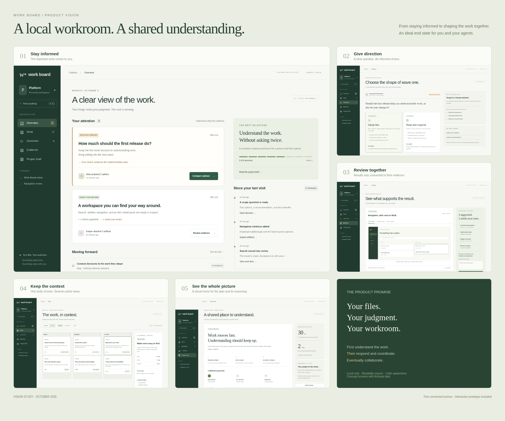

# Work Board north star

Work Board is a local, file-backed workspace for a person and their agents to
understand work, exchange direction, coordinate, and eventually collaborate.
Open it to know what is happening, what changed, what needs your judgment, and
where the evidence lives. Close it without losing the work: the meaningful
content remains readable in the project files.

This is the proposed product direction. The [roadmap](./roadmap.md) owns delivery
status and discussion gates. The [experience design](./experience.md) describes
the target interactions. The [vision prototype](./mockups/index.html) illustrates
the end state with fictional data; it is not the implemented application.
The [package README](../../README.md) describes shipped behavior.

## Visual direction

Explore the [five screens and mobile layouts](./experience.md#screen-gallery), or
run the [interactive prototype](./experience.md#prototype-use) locally. The screens
combine the target waves and use fictional data; they do not indicate delivery
status.

## The progression

1. **Stay informed.** Agents work in the files and the board makes their plans,
   progress, results, questions, and uncertainty understandable.
2. **Inform back and coordinate.** The person responds in context, records a
   decision, requests a revision, and directs the next handoff.
3. **Collaborate.** People and agents refine the same work with explicit
   ownership, preserved context, conflict handling, and inspectable evidence.

Each stage must be independently useful. A good reading experience is the first
product, not a temporary screen waiting for an orchestration engine.

## Who and what it serves

The primary user is a developer coordinating their own work and several agents
across project files. The board is the shared place to inspect and discuss that
work. Agent tools remain responsible for running agents; editors and Git remain
useful independent of the board.

The core objects are work items, documents, decisions, evidence, and handoffs.
Views arrange these objects for different questions; they do not create competing
copies. A source document can remain narrative while its work items appear in a
board or table. Relationships connect a goal to its plan, decision, implementation,
acceptance criteria, and result.

## Product commitments

- **Local only.** No hosted service, accounts, cloud sync, publishing, or remote
  multiplayer. Local HTML/PDF exports are portable files. Optional external
  evidence retrieval is a separate, explicit integration, never a dependency of
  the core experience.
- **Readable source.** Plain Markdown remains a useful entry point. Rich metadata
  is optional and documented. No hidden database becomes the only copy of work.
- **Calm awareness.** Attention means a question, blocker, review, or material
  change. Quiet ongoing work should remain quiet.
- **Evidence over activity.** Running, producing output, finishing a run, and
  satisfying acceptance criteria are different states.
- **Direction in context.** A response belongs to the work and evidence it refers
  to. Avoid a second generic chat feed that loses the connection.
- **Trustworthy change.** Source, freshness, provenance, and uncertainty remain
  visible. A summary links back to the material supporting it.
- **Progressive structure.** A folder and one command should remain enough to
  start. More ambitious workflows earn their complexity through use.
- **One coherent experience.** Documents, cards, tables, visual compositions, and
  decisions share navigation, selection, typography, and source links.

## A day in the target product

You return to a project. Overview explains that a result is ready for review and
one scope decision is blocking the next handoff. You open the result beside its
acceptance criteria and inspect the attached evidence. You ask for one revision
without leaving the item. The agent receives the relevant context through its
existing tool integration. You compare two scope options and record your choice.
The board shows the resulting next action and what remains waiting. Later, you
can understand the decision from the files without replaying a conversation.

## What a 10× improvement means

The target is substantially less effort to regain context and direct work.
Measure this through representative tasks before and after each wave:

| Question | Proposed success criterion |
| --- | --- |
| What needs my attention? | Identify the actual decision or blocker within 30 seconds of returning |
| Why are we doing this? | Reach the source decision and relevant evidence within two navigation steps |
| What changed? | Distinguish meaningful changes from file churn without rereading the project |
| Can I trust this result? | See which criteria are verified, claimed, missing, or stale |
| Can I direct the next step? | Respond on the exact item without reassembling its context |
| Does it scale? | Navigate a representative 50-document, 100-item workspace comfortably |
| Are my files safe? | Relevant mutation tests demonstrate preserved text and detected stale writes |

These are proposed acceptance targets, not measured outcomes or release dates.

## Boundaries

Do not grow a generic project-management suite, agent scheduler, terminal fleet,
plugin marketplace, arbitrary script dashboard, or new event-sourcing system.
Use existing Platform conventions where they fit; preserve the current server,
watcher, rendering, and embedding path. Package/API changes and the write-back
contract need their own design review before implementation.

Immediate product priorities are orientation, navigation, visual clarity,
relationships, evidence, and freshness. Editing and agent coordination are wave 2
discussion topics. Narrow external integrations enter wave 3 only when they remove
a demonstrated manual step.
