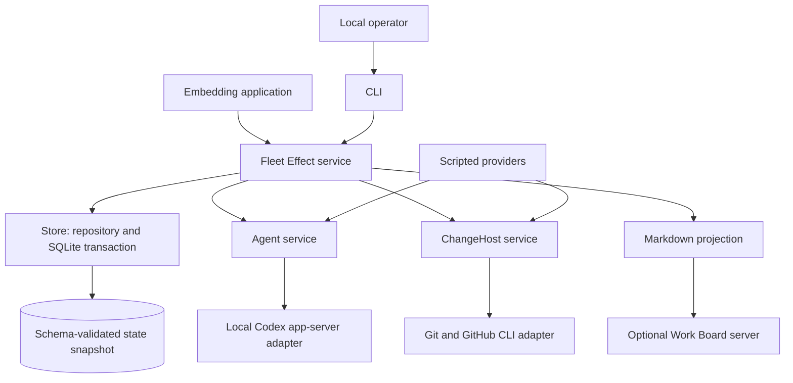
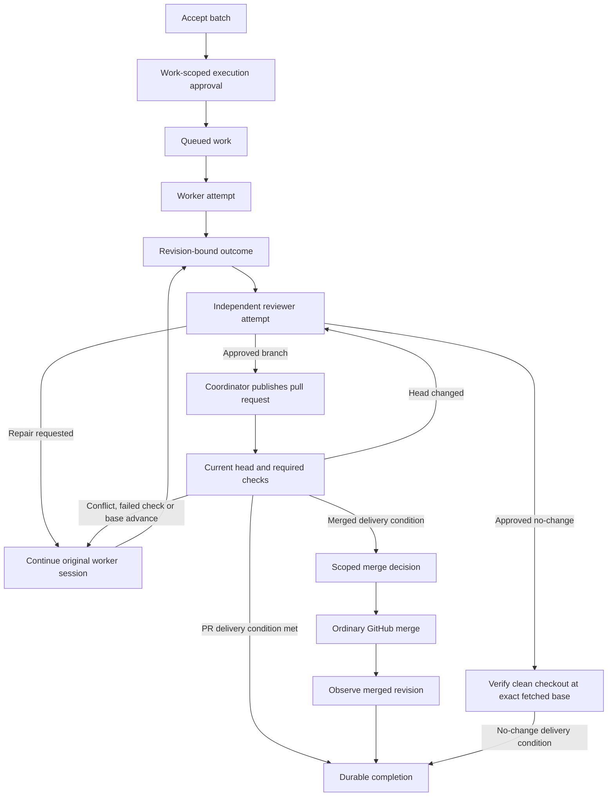
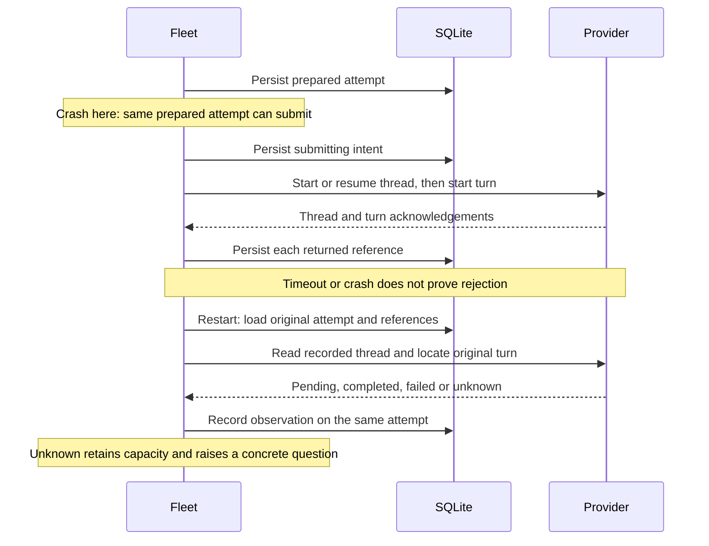

# Work Fleet architecture

One Effect service reconciles a finite batch against agent and change-host
observations. SQLite owns truth. Processes, polling fibers and generated Markdown
can be replaced without replacing the batch.

## Components

Services use Layers. Runtime processes, streams, deadlines, polling, resources
and concurrency use Effect. A semaphore serializes coordinator operations;
scoped resources own the Codex subprocess and protocol fibers. The CLI is the
executable runtime boundary. Protocol and stored data pass through Schema. The first tick persists the
agent and change-host identities; a different backend cannot resume that state.
This keeps scripted observations out of real delivery.

## Durable model

| Record | Meaning |
| --- | --- |
| Work | Approved inputs, phase, current outcome, review, host observation and any concrete human question. |
| Attempt | One worker or reviewer turn, durable submission status, provider references and observed result. |
| Outcome | A committed branch, a pull request, or a justified no-change result tied to a revision. |
| Decision | A local operator's reasoned, work-scoped approval, merge authorization, hold or resume. |
| Policy | Execution capacity, lifetime attempt budget, admission stop and quota availability. |

A single versioned JSON snapshot sits in one SQLite row. The repository decodes
and encodes it with Schema, and every update runs in a transaction. This keeps
cross-record invariants in one small transaction without a journal or an event
framework. Its cost is reading and writing the whole state: this design targets
small finite batches, not an unbounded history service.

A separate SQLite lock database holds an exclusive transaction for the process
lifetime. A second process fails to acquire ownership. Administrative CLI
commands therefore require the running coordinator to stop first. The operating
system releases the lock after a crash; deleting a lock file is not a recovery
procedure.

## Reconciliation and delivery

A tick observes existing attempts, reconciles outcomes, then admits eligible
work. Dispatch rereads state after each launch, so accepted and uncertain
attempts immediately consume capacity. Reviewers consume capacity but do not
create writer reservations. Writer ownership lasts until the work completes;
path overlaps and shared checkout use serialize writes. Core batch acceptance
canonicalizes checkout paths and repository case, and refuses a database inside
a worker checkout, including for embedded callers. Equal paths with
different structured keys can have separate reservations, but the concrete
publisher currently requires whole-path authority before publishing changes.

A worker's turn ending only supplies an outcome. Review must approve that exact
revision. A changed PR head invalidates the old review; a changed base requests
integration and validation. Failed checks and conflicts request another turn in
the original worker session. The coordinator publishes reviewed commits and
requires the configured checks and GitHub's merge-ready state before delivery.
Unknown checks remain pending. It never requests administrator bypass.

A pull-request completion condition ends after review, required checks and
change-host verification of the revision and allowed changed paths. A
merged condition additionally needs operator merge authority and an observed
merge. A no-change condition needs a justification, independent approval and a
clean checkout at the exact fetched base revision with no changed paths and passing
configured commit checks. Those check results are observations from GitHub; they
do not claim that the coordinator executed tests locally. Terminal attempts
are retained and are not reread each tick; work-level head and base observations
invalidate revision-dependent review evidence. Completed work is a recorded
delivery outcome, not continuous monitoring of a repository forever.

## Submission and crash recovery

There is no exactly-once provider guarantee. Intent precedes the external call,
which creates a conservative window where a crash before transmission is
indistinguishable from a lost acknowledgement. A prepared attempt can submit;
a submitting or uncertain attempt must reconcile. A known thread without a
turn identifier is searched for the durable attempt marker. No known thread or
an ambiguous match needs human investigation and does not authorize replacement.
An inactive process with an unfinished turn remains uncertain.

Publication and merge also record intent first. Publication recovery looks for
the deterministic branch and exact revision. Merge recovery observes the PR.
Known preflight rejection is distinct from an uncertain mutation: repairable
failures return to the worker, configuration restrictions need a human, and
retryable reads can be observed again. An unresolved external write is never
blindly repeated. This can leave an item
waiting for an operator even when the remote side did nothing; a future explicit
recovery action must preserve that distinction.

## Authority and integration boundary

The trusted local operator supplies immutable work inputs and public PR metadata,
then records scoped decisions through the service or CLI. Workers and reviewers
receive no decision API. A worker result cannot authorize merge. This is not
multi-user RBAC: a process that can edit the database or invoke the trusted
service has operator authority. Keep database and checkout access under the
operator's control.

The initial agent adapter uses the installed Codex `app-server` protocol. It
requires an existing ChatGPT sign-in and refuses API-key account mode. It does
not implement a hosted Cloud endpoint or silently switch to API billing. The
adapter is isolated because installed CLI protocol compatibility is its actual
support boundary; it is not a stable hosted service contract.

Workers require a dedicated standalone clone with a real `.git` directory. An
explicit Codex permission profile grants write access to that clone and its Git
metadata, keeps temporary directories inside the metadata and disables network
access. Linked worktrees and metadata symlinks are refused. Reviewers get
read-only access and separate sessions. These profiles do not isolate all
readable local data. Enabled inherited MCP servers are refused before execution
because the shell sandbox does not constrain their tools. Installed CLI protocol
and sandbox compatibility remain requirements; permissions never broaden
automatically.

GitHub access uses the operator's existing `git` and `gh` authentication. The
adapter validates the repository, base, clean revision, origin and changed paths
before publication; it uses a deterministic branch and approved public metadata.
Coordinator Git commands accept only a narrow local configuration and disable
hooks and external diff commands. PR completion also verifies scope against the
current local revision. Merge rereads the PR and checks its head before the ordinary merge command.
Required check names are configurable. Deployment-specific code and promotion
authority are absent; integrations can supply checks through GitHub.

Markdown is only a projection. Work Board's existing router Layer can serve it
inside another Effect HTTP application, or its CLI can serve the output folder.
Work Fleet takes no dependency on that server and exposes no write action through
the generated files.

Before a merge request, the coordinator records scope verification and passing
required checks for the exact reviewed revision. A later merged observation
cannot complete work without that evidence. An adopted, already merged PR that
lacks this evidence is held for a concrete operator decision.
